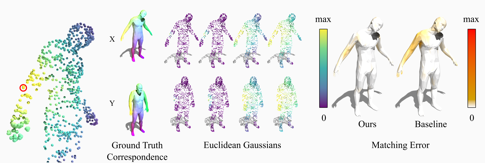

# Localized Gaussians as Self-Attention Weights for Point Clouds Correspondence



## How to run

### Training

To train the model run:

```bash
python train.py --run_name MODEL_NAME [--gaussian_heads H] [--sigma SIGMA_1 ... SIGMA_H] [--learn_sigma] [--noise NOISE_LEVEL] [--noise_p P]
```

where:

- `MODEL_NAME` is the name of the model you want to train. The model will be saved in the `models` folder with the `.pt` extension.
- The `--gaussian_heads` flag specifies the number of Gaussian heads to use in the model.
The `--sigma` flag specifies the standard deviation of the Gaussian heads.
- If `--learn_sigma` is used, the standard deviation will be learned during training.
If both `--sigma` and `--learn_sigma` are used, the standard deviation will be learned and initialized with the values provided.
- The `--noise` flag specifies the noise level to add to the input point clouds. The noise is added with probability `--noise_p`.

### Testing

To test the trained model on FAUST1K, simply run:

```bash
python test.py --run_name MODEL_NAME
```

where `MODEL_NAME` is the name of the model you want to test. The model should be in the `models` folder and is to be used without the `.pt` extension.

To test using a different dataset, you can use the `--dataset` flag:

```bash
python test.py --run_name MODEL_NAME --dataset DATASET_NAME
```

where `DATASET_NAME` is the name of the dataset you want to test on, without extension. The dataset should be in the `dataset` folder.

## Acknowledgements

Training and testing code are based on the implementation of raganato:
[https://github.com/raganato/SGP23_AttPos4ShapeMatching]

The code uses a modified version of the X-Tranformers library by Lucidrains:
[https://github.com/lucidrains/x-transformers]

Datasets, Utils and Testing from the transmatching are based on the code by GiovanniTRA:
[https://github.com/GiovanniTRA/transmatching]
